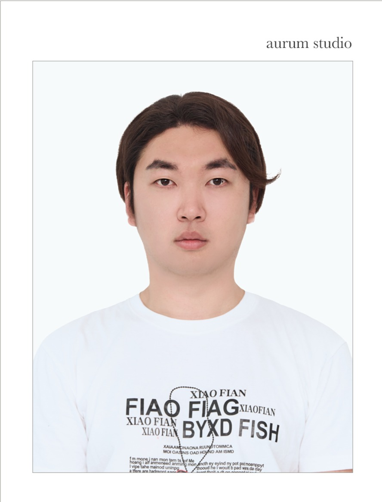

# 👋 About Me  
<p align="center">

<p/>

안녕하세요, **프론트엔드 개발자 유준상**입니다.  
3년간 웹 프론트엔드 분야에서 꾸준히 경험을 쌓는 중이며,  
코드를 단순히 작성하는 것에 그치지 않고, **문제를 구조적으로 해결하고 유지보수가 용이한 코드**를 만들기 위해 노력합니다.
개발자라는 직업은 모름지기 **평생 공부하고 발전해야하는 직업**이라고 생각합니다. <br>
현재에 안주하지 않고 꾸준히 스스로를 발전시키는 개발자가 되도록 항상 노력중입니다.

---

## 💼 Career  
### 현재 재직
- **🍅 토마토시스템 (2022.09 ~ 현재)**  
  - **역할**: 웹 프론트엔드 개발자  
  - **주요 업무**: 사내 UI솔루션 활용 개발 및 유지보수, 신규 기능 구현, 기술지원, 공통 컴포넌트 개발

---

## 🚀 Project Experience  
### 📌 국민건강보험공단 통합징수시스템 전환 (2025.07 ~ 진행 중)  
- **기술 스택**: Java, JS, eXBuilder6, LESS
- **업무**: AS-IS 시스템 전환

### 📌 한전 EERS 시스템 개발 (2025.03 ~ 2025.06)  
- **기술 스택**: JS, eXBuilder6, LESS 
- **업무**:  공통/업무 컴포넌트, 화면 퍼블리싱 및 공통 개발

### 📌 인사혁신처 차세대 프로젝트 (2024.08 ~ 2025.02)  
- **기술 스택**: JS, eXBuilder6, LESS
- **업무**: 공통/업무 컴포넌트, 화면 퍼블리싱 및 공통 개발

### 📌 흥국생명 선심사 도입 및 SFA 재구축 (2024.03 ~ 2024.07)  
- **기술 스택**: JS, eXBuilder6, LESS
- **업무**: 공통/업무 컴포넌트, 화면 퍼블리싱 및 공통 개발

### 📌 푸본현대생명 New GA 영업지원시스템 개발 (2023.07 ~ 2024.02)  
- **기술 스택**: JS, Java, Spring, eXBuilder6, LESS, SVN  
- **업무**: 보험 가입설계 프론트엔드 개발 담당 및 UI솔루션 공통 개발/퍼블리싱

---


# 🛠 Skills  
<p align="center">
 

 
 


<p/>

<!--
---
# 🧠 Memory Tree (Knowledge Map)

👉 지식을 단순히 암기하지 않고, **연결 구조로 이해하려고 노력합니다**
제가 학습한 내용을 단순한 나열이 아니라, **구조적으로 연결된 지식 트리 형태로 정리**하고 있습니다.
<p align="center">
  
</p>

> 📌 GitHub에서는 이미지로 확인하고,
> 실제 구조는 Obsidian Canvas를 통해 관리하고 있습니다.
---
-->

## Frontend 
- **React** : 기본 개념 학습 및 개인 프로젝트 준비중
- **JavaScript** : 비동기 처리, 스코프, 클로저 등 핵심 개념 이해 및 실무 적용
- **HTML / CSS / LESS** : 반응형 UI 및 재사용 가능한 스타일 구조화
- **eXBuilder6** : Dataset 기반 UI 개발 및 공통 컴포넌트 설계

## Backend  
- **Java (Spring Framework)** : API 개발 및 서버사이드 로직 구현 기초 경험 

## DevOps & Tools  
- **Git / GitHub / SVN** : 협업 및 형상 관리 경험  
- **CI/CD** : Jenkins 를 이용한 빌드 자동화 기초 경험
- **Database** : MySQL, Oracle 기초 경험  

---

# 📚 Learning & Interests  
- **Clean Architecture & Design Patterns** : 유지보수가 쉬운 코드 구조 설계  
- **UI/UX 개선** : 사용자 친화적인 인터랙션 및 접근성 향상  
- **새로운 기술 탐구** : 프론트엔드 최신 트렌드  

---

# 🚀 Career Goal  
저는 개발을 단순한 업무가 아니라, **꾸준한 학습과 성장을 통해 더 나은 가치를 만들어내는 과정**이라고 생각합니다.  
앞으로도 사용자에게 즐거운 경험을 주는 서비스를 만들고, 함께 성장하는 개발자로 나아가겠습니다.  

---

# 📂 Skills Repository  
이 레포지토리는 제가 학습하고 정리한 **개발 지식과 실습 코드**를 모아둔 저장소입니다.  
실무에서 다루는 프론트엔드 기술부터, 알고리즘 학습, 각종 문서 정리까지 카테고리별로 정리되어 있습니다.  

---

## 📑 Repository Structure  
```bash
.
├── doc/          # 온라인 강의 및 개인적인 학습 내용 정리
├── frontend/     # 프론트엔드 기술 학습 및 실습 예제
└── study/        # 학습/연습용 코드 및 자료
    ├── algorithm     # 알고리즘 문제 풀이 및 해설
    ├── js-snippet    # 자바스크립트 유틸 함수, 코드 조각 모음
    └── react         # 리액트 관련 실습 및 컴포넌트 예제

